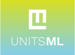

= UnitsML branding guide

== Typography

The designated font is https://fonts.google.com/specimen/Work+Sans[Work Sans]
available from Google Fonts under an Open Font License.

The two typeface weights used are:

* Work Sans Light
* Work Sans Semibold

.UnitsML logotype

== Logo

=== Shape and philosophy

[quote,Lao Tze]
____
What is empty provides utility.
____

The graphical logo incorporates the letters U, M and L
in the same rectangular shape, with the "U" visible in
the negative space.

Units serve a crucial purpose but are often overlooked
in measurements. Echoing the said quote, units benefit
the world best by remaining hidden.

The logo is designed by http://simpleisbeautiful.ca[Jen Scarisbrick].

.UnitsML logo shape

=== Variants

The logo is designed to allow incorporation of different
color fills to suit different occasions.
Plain, gradients or patterns all work.

.Type 1

.Type 2
image::logo-02.svg[]

.Type 3

.Type 4

.Type 5

.Type 6

== License

Copyright Ribose.
